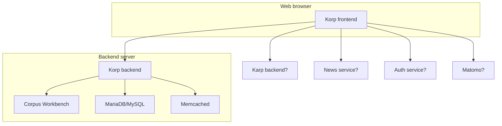
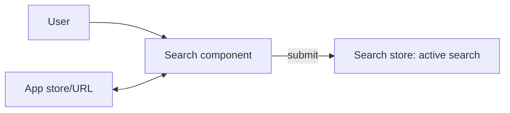
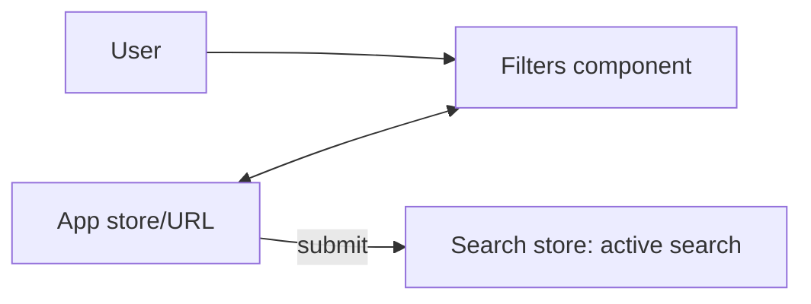
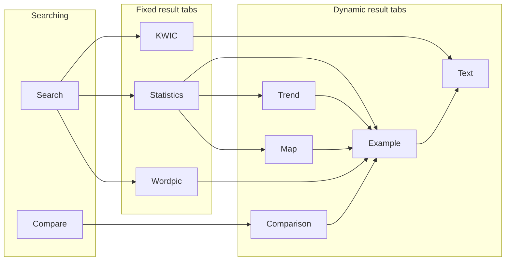
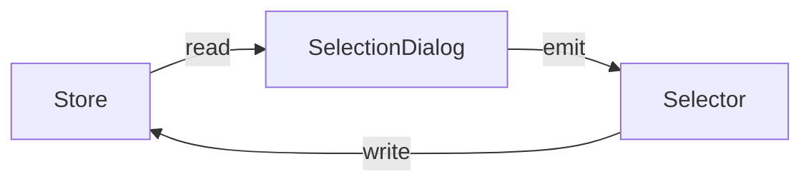
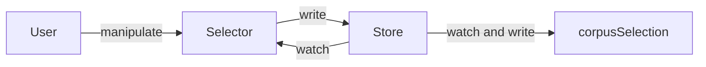

# Architecture

## System

The Korp system mainly consists of:

- **Korp frontend** running in the user's web browser, presenting a graphical user interface (GUI) to the services of the backend
- [**Korp backend**](https://github.com/spraakbanken/korp-backend/) running on a server, executing data queries and making statistical calculations

The frontend communicates with the backend using the [Korp API](https://ws.spraakbanken.gu.se/docs/korp). The API can also be used directly from command-line or scripts.

More parts of the system are visualized in this diagram:



## Layout

**Base code** lives in `src/`.
Some of the sub-directories are:

```sh
├── src
│   ├── assets          # Images etc, subject to Vite asset handling
│   ├── auth            # Authentication services
│   ├── components      # Reusable Vue components and composables
│   ├── core            # Core code is not dependent on Vue
│   │   ├── backend     # Code for using the Korp API
│   │   │   └── proxy   # Proxies add parameter/response handling to API endpoints
│   │   ├── config      # Code for reading frontend settings and corpus config
│   │   ├── cqp         # Parses and serializes to the CQP query language
│   │   └── task        # Task classes define most result types: maps, trend graphs etc
│   ├── i18n            # Code for showing the UI in a chosen language
│   ├── locale          # UI strings in English and Swedish
│   ├── page            # Components that build up the page layout (header, etc)
│   ├── results         # Result-related components
│   ├── search          # Search-related components
│   └── store           # Pinia stores for app state
```

The code is divided into **Core code** and **View code**:

- Core code, under `@/core`, has no dependencies on Vue.
  It could be migrated to another TypeScript project that uses another UI library or none.
  The usefulness of this separation was apparent when migrating from AngularJS to Vue.
- View code, outside `@/core`, uses Vue concepts for reactivity etc.

We strive to keep the View layer thin, and manage as much as possible in Core code.

### Instance code

Instance code must be placed in `instance/`.

The instance directory is left out of version control so that you can control its content separately.
We recommend you keep your instance code in its own git repository
and either clone it directly as `./instance` or place it outside and symlink to it.

```sh
├── instance
│   ├── locale          # Custom UI strings (optional)
│   │   └── xyz.yaml
│   ├── plugin.ts       # Instance plugin
│   └── settings.ts     # Instance settings
```

- The _instance plugin_ must export an async function that returns `Promise<Plugin>`, see [Vue Plugin docs](https://vuejs.org/guide/reusability/plugins)
- The _instance settings_ must export an `InstanceConfig` object (see [instanceConfig.types.ts](../src/core/config/instanceConfig.types.ts)) with frontend settings
- _Instance locales_ should be present if the `languages` setting includes languages other than Swedish and English

Read more about the instance concept in [INSTANCE.md](./INSTANCE.md).
Take a look at [korp-vue-sb/plugin.ts](https://github.com/spraakbanken/korp-vue-sb/blob/main/plugin.ts) for a real example.

Consider separating core and view code in your instance too,
to make it easier to re-use code in the future.

## Data flow

This section outlines the application workflow from a technical perspective.

### Initialization

#### App creation

In `main.ts`, the Vue app is created and mounted. See [Vue docs on Creating an Application](https://vuejs.org/guide/essentials/application.html).

1. The `mode` and `lang` params are read from the URL
2. **Instance settings** are loaded to the global `settings` object
3. The Vue-I18n plugin is installed using configured **languages**
4. The Matomo plugin is installed if configured
5. The **instance plugin** is installed with the mode passed as a parameter
6. Finally, the app root component `App.vue` is mounted

#### Root component

The root component first just shows an animation to indicate that the app is loading.
It immediately calls `init()` of the `useInit` composable, wherein:

1. The configured **authentication module** is loaded and checks if the user is logged in
2. **Corpus config** is fetched from the backend and merged into the global `settings` object
3. The global **corpus listing** object is created from the corpus config
4. **Time data** starts loading in the background
5. The **app store** is created and its state is synced from URL parameters

Once this is done, the animation is replaced with the main **page layout**:

- The page header with navigation, the corpus selector and the search panel
- The main section with the frontpage, later replaced by the result panel
- The page footer

#### Initial state

The loaded URL may have parameters that are synced to the app store at initialization.
The user interface should reflect this state.
Usually, concerned components just have to read the store state reactively,
using `storeToRefs()` or similar.
However, the corpus selection and active search need special handling.

When the corpus selector component `CorpusSelector.vue` is mounted,
it initializes the corpus selection.
Via the `CorpusSelectionDialog.vue` component,
the selection is read from the store (≈ URL) and validated against config and authentication status.
This is an async process that may involve showing dialogs and modifying the selection.
When validation is done, the final selection is set in the global `corpusSelection` object.

If the initial store state contains a search,
the search is performed once the corpus selection is finalized.
The search store (`useSearchStore`) waits for the corpus selection,
using the `useReactiveCorpusSelection` composable
(see [Reactive singletons](#reactive-singletons)).

#### Time data

Time data is loaded with the `timespan` backend command,
and contains token counts per corpus and year.
It is used for:

- the time graph in the corpus selector
- the date Interval search widget
- enabling Trend graph results

### State

Most of the app state is synced between **URL parameters** and a [Pinia](https://pinia.vuejs.org/) store, the **app store** (`useAppStore`).
This means the URL can be copied and reloaded (elsewhere), and the state will be mostly restored.
For type safety, use the store instead of reading or manipulating URL parameters.

In this application, parameters are found both in the _query_ and the _fragment_ of the URL,
e.g.: `/korp?mode=parallel#corpus=saltnld-sv`
The only query parameter is `mode`.
It is read at initialization and not expected to change during the application lifetime
– when navigating to another mode, the page is fully reloaded.
The app state, on the other hand, uses the fragment part.

### Search

Formulating search queries is a vital part of this application, and the data flow is somewhat complicated.

Each of the three **search components** maintains its own model of a search query.
It watches the app store and syncs changes into local state,
primarily to support restoring search queries at initialization.

| Search component | Query model                                        | `search` in store                 | `cqp` in store |
| ---------------- | -------------------------------------------------- | --------------------------------- | -------------- |
| Simple           | plain-text/lemgram string, checkbox options        | `word\|<...>` or `lemgram\|<...>` | —              |
| Extended         | a structure of attribute-operator-value conditions | `cqp`                             | a CQP query    |
| Advanced         | a string in the CQP query language                 | `cqp\|<...>`                      | —              |

When the user hits the Search button, the component writes values back to the same store params.
More importantly, it commits the query to the **search store** (`useSearchStore`)
as the **active search** (`activeSearch`).
Result tabs watch this and start processing the query in order to send backend requests.



The Simple and Extended components also use the search store
to sync the query-under-construction to the Advanced component
(as `querySimple` and `queryExtended`)
so they can be shown there.

#### Global filters

Some corpora offer _global filters_, i.e. dropdowns for specific text attributes.
Filter selections are continually synced to `global_filter` in the app store.
The filter conditions are merged in when setting the active search.



The available filter values must be fetched from the backend,
so the filter UI is not available immediately after initialization.
However, if the initial URL/store contains a filter selection,
it is assumed to be valid,
so the initial search doesn't have to wait for the filter values to load.

#### Parallel mode

In parallel mode, there is just a variant of the Extended component, with multiple queries in different languages.
Global filters cannot be used.

### Results

By default, the main section shows the frontpage component.
Once an active search is set, this is replaced by the results panel.

The panel has three **fixed result tabs**: KWIC, Statistics and Word picture.
The latter two are initially inactive, and are only activated when they are first opened.
Each active tab watches the active search and turns it to a backend request.

For many backend endpoints, there is a corresponding **proxy** class.
The proxy bridges between the frontend and backend perspectives on a query.
For instance, it can transform a given page and page size to start and end params for the backend request,
or calculate `within` params from the set of selected corpora.
It also typically processes response data to a shape and type that is easier to use in frontend code.

Some requests can be incremental, and the proxy can use **progress handlers**.
At each new response part received,
the result component can then show partial results and update a progress percentage.

Many result tabs offer an **options bar** where the user can customize the result.
Some options, when changed, trigger a new request with different params (e.g. KWIC context).
Others just modify the display (e.g. relative frequencies in Statistics).
A conceptual distinction is made where _search options_ can affect the set of results,
while _result options_ only may affect what information is (retrieved and) shown for those results.

#### KWIC

Clicking a token in the KWIC result sets the **selected token**.
This is a ref that is provided by the KWIC container
and then used in the **KWIC sidebar** to display data of the token and its context.

When the **sort** option is set to **random**, a seed is randomized and added to the store/URL.
Thus, reloading the page reproduces the same result order.
After the initial search, however, submitting a new search causes a new seed to be generated.

If the corpus supports it,
a button in the sidebar will open a dynamic _Reading mode_ tab with the full document text.

#### Statistics

The statistics response is processed to merged rows where values differ only by rank suffix.
This happens in a [Web Worker](https://developer.mozilla.org/en-US/docs/Web/API/Web_Workers_API), `@/core/statistics/statisticsWorker`,
to avoid freezing the main thread.

The table can get very large, and it is shown in a grid that only renders the content of the current scroll viewport.

Clicking an attribute-value cell opens a dynamic _Example KWIC_ tab for the occurrences of that row.
Clicking a frequency value cell opens occurrences of that cell.

If rows are selected using the checkbox column,
and there are attributes in the corpora to support it,
the _Trend graph_ and _Map_ buttons can be used to open corresponding dynamic tabs.

#### Word picture

In code, we prefer the term _wordpic_ for simplicity.

The `relations` backend command returns a list of relation objects.
These are restructured as a multi-dimensional list ordered by
_sections_ (word + POS), tables and columns.

Clicking a related word opens a dynamic _Word picture example KWIC_ tab for that relation.
Such a result set cannot be captured by CQP queries,
so text sources behind relations are encoded in the backend database.
This requires different code than the normal Example KWIC,
but the result display is the same.

#### Dynamic result tabs

Some features trigger new types of results, in **dynamic tabs** that can be closed again.
For instance, when clicking a frequency value in the Statistics table,
a KWIC is opened with the corresponding search hits.

A dynamic tab is opened by creating a **task** object (of a class extending `TaskBase`)
and calling `createTab()` of the `useDynamicTabs` composable.
The mapping between task classes and result components is defined in `ResultsPanel.vue`.

A dynamic tab can be closed by the user.
The task object is simply removed from the list,
and the result component is destroyed.

Unlike fixed tabs, dynamic tabs are not dependent on the active search.
Instead, they base their backend request on data provided in the task object
(and possibly result options or app state).

An overview of which result tabs can open other tabs:



##### Trend graph

The trend graph uses the `count_time` command to get frequencies by time period.
It uses the Chart.js library to show an interactive line/bar chart.

Clicking a time point opens a dynamic _Example KWIC_ tab with results for that time point.

##### Map

The map uses the `count` backend endpoint, just like statistics,
but with specific parameters and response handling.

Clicking a marker's info box opens a dynamic _Example KWIC_ tab with results for that location.

##### Example KWIC

The Example KWIC tab behaves much like the fixed KWIC tab.
Most notably, the result options are fewer.

##### Reading mode

In code, we prefer the term `Text` for simplicity.

This uses the `query` command, like the KWIC results,
but retrieves only a single row with all tokens of a given text ID.
Tokens are displayed with reconstructed surrounding whitespace.

The backend request is slow, and we generally recommend the
[Strix](https://spraakbanken.gu.se/en/tools/strix) platform
for document-scope corpus research.

### Comparison

The comparison feature is special in that it has its own search component,
and a dynamic tab that doesn't originate from another result tab.

The user must first save search queries using the other search components.
This uses the `useSearchStorage` (≠ `useSearchStore`) composable,
which in turn uses the browser's `localStorage` to persist data across visits.

In the Compare search component,
the user can then choose two saved queries.
Submitting the form creates a task and a dynamic tab.

Clicking a value opens a dynamic _Example KWIC_ tab with the occurrences of that value.

## Concepts

### Corpus listing and selection

The `corpusListing` and `corpusSelection` objects are global instances of the `CorpusSet` class.
In parallel mode, however, they use the `CorpusSetParallel` subclass.

The `corpusListing` is created as soon as corpus config has been loaded, and then doesn't change.

The `corpusSelection` is first created empty.
When the async corpus validation is done,
it is filled with the initial selection,
see [Initialization](#initialization).
After that, it is updated whenever the user changes the corpus selection.

Data flow of the corpus selection during initialization:



And after initialization:



The `CorpusSet` class is also instantiated for various subsets of the listing or selection.

### Reactive singletons

The Vue `reactive()` function makes any object reactive.
This can be used on objects in Core code to make them observable by View code.

Notably, there are the `useReactiveCorpusSelection` composable for `corpusSelection`,
and the `useReactiveFilterManager` composable for `GlobalFilterManager`.

Note that the reactive wrapper will only notice changes made to the wrapper,
not to the original Core object.

### Code splitting

Vite's build process splits the code into _chunks_
so that they can be loaded in parallel and when needed.
See [Vite docs: Chunking strategy](https://vite.dev/guide/build#chunking-strategy).

In summary, use _dynamic imports_ (`import(...)`) where depended-on code can be loaded async.
Use it especially when importing large pieces of code, e.g. a third-party library.

It is especially valuable to keep the _index chunk_ small, so that the initial load of the app is quick.

### CQP Parser

The CQP (Corpus Query Processor) language is used to express searches in Korp.
More information on the language is available in the Advanced search tab of the running frontend app.
Mainly, the frontend creates CQP query strings (`stringify()`)
from the user's input data and uses them in backend commands.
Certain parts of the frontend also recreates query data from CQP strings (`parse()`).

The parser is written as a [Peggy](https://peggyjs.org/) grammar, `CQPParser.peggy`.
It does not cover all of CQP, but it should cover all queries that `stringify()` can create.

In the Advanced tab, the user can enter any CQP supported by the backend,
even if it is not covered by the frontend parser.

Within the frontend, the parser and stringifier actually use a non-standard variant of the CQP language,
with custom operators and a special date-interval syntax.
To output the standard CQP format, use `stringify(query, true)`.

### Errors

#### Errors in place of content

Use the `ErrorBox` component to show an error message in place of expected content.
Use the `useError` composable to have any exception interpreted in a more user-friendly way,
and structured for use with `ErrorBox`.

```ts
const { setError, errorMessage } = useError()

try {
  // ...
} catch (error) {
  setError(error)
}
```

```html
<ErrorBox v-if="errorMessage" v-bind="errorMessage" />
```

#### Floating errors

Use the _message store_ (`useMessageStore`)
to show a floating error message in the top-center of the screen.
This is useful when there isn't a certain location to show the error.

Uncaught errors and rejections are caught by listeners set in `App.vue`,
and displayed using the message store.

### Icons

The FontAwesome icon library is used to clarify functionality where appropriate.

1. Search available icons on https://fontawesome.com/search?ic=free-collection
2. In `@/fontawesome`, import the desired icon from the _solid_ or _regular_ collection
   and add it to the library
3. Use `<fa-icon icon="..." />` to insert the icon in a component template

To use new icons in instance code,
replicate the `@/fontawesome` module but without the Vue plugin (the `install` function).
Then you can add new icons to the same FontAwesome `library` object.

### Modal dialog

The `ModalDialog.vue` component provides two ways to control it:

With Bootstrap data attributes
(see [Bootstrap docs](https://getbootstrap.com/docs/5.3/components/modal/#via-data-attributes)).
This is easier when you just need to open the modal from a parent component.

```html
<button type="button" data-bs-toggle="modal" data-bs-target="#my-modal">...</button>
<ModalDialog id="my-modal">...</ModalDialog>
```

With the VueUse `useConfirmDialog` controller
(see [VueUse docs](https://vueuse.org/core/useConfirmDialog/)).
This gives the parent component an interface to control and listen to the modal.

```ts
let loginDialog: ConfirmDialog | undefined

function open() {
  loginDialog?.reveal()
}
```

```html
<ModalDialog @setup="loginDialog = $event">...</ModalDialog>
```

## Tests

TODO.
There is a bunch of end-to-end (e2e) tests in the
[playwright](https://github.com/spraakbanken/korp-frontend/tree/playwright)
branch of the old frontend.
They should be ported to this rewrite.
We would also benefit from adding functional tests,
especially on most of the core code
which has less dependencies and side effects.
