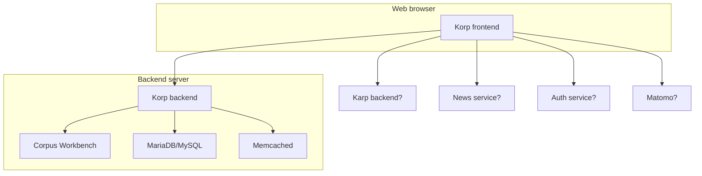
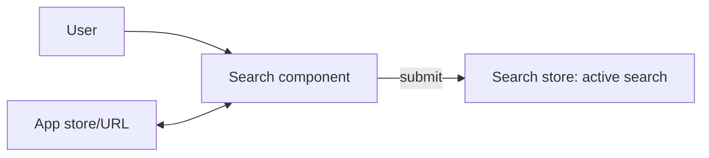
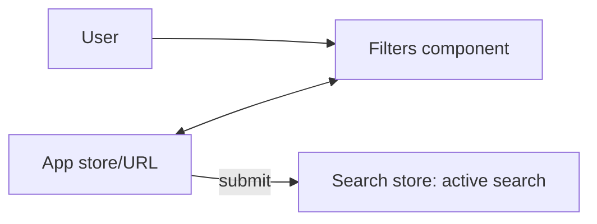

# Architecture

## System

The Korp system mainly consists of:

- **Korp frontend** running in the user's web browser, presenting a graphical user interface (GUI) to the services of the backend
- [**Korp backend**](https://github.com/spraakbanken/korp-backend/) running on a server, executing data queries and making statistical calculations

The frontend communicates with the backend using the [Korp API](https://ws.spraakbanken.gu.se/docs/korp). The API can also be used directly from command-line or scripts.

More parts of the system are visualized in this diagram:



## Layout

Base source code lives in `src/`.
Some of the sub-directories are:

```sh
├── src
│   ├── assets          # Images etc, subject to Vite asset handling
│   ├── auth            # Authentication services
│   ├── components      # Reusable Vue components and composables
│   ├── core            # Core code is not dependent on Vue
│   │   ├── backend     # Code for using the Korp API
│   │   │   └── proxy   # Proxies add parameter/response handling to API endpoints
│   │   ├── config      # Code for reading frontend settings and corpus config
│   │   ├── cqp         # Parses and serializes to the CQP query language
│   │   └── task        # Task classes define most result types: maps, trend graphs etc
│   ├── i18n            # Code for showing the UI in a chosen language
│   ├── locale          # UI strings in English and Swedish
│   ├── page            # Components that build up the page layout (header, etc)
│   ├── results         # Result-related components
│   ├── search          # Search-related components
│   └── store           # Pinia stores for app state
```

### Instance code

Instance code must live in `instance/`.

The instance directory is left out of version control so that you can control its content separately.
We recommend you keep your instance code in its own git repository
and either clone it directly as `./instance` or place it outside and symlink to it.

```sh
├── instance
│   ├── locale          # Custom UI strings (optional)
│   │   └── xyz.yaml
│   ├── plugin.ts       # Instance plugin
│   └── settings.ts     # Instance settings
```

- The _instance plugin_ must export an async function that returns `Promise<Plugin>`, see [Vue Plugin docs](https://vuejs.org/guide/reusability/plugins)
- The _instance settings_ must export an `InstanceConfig` object (see [instanceConfig.types.ts](../src/core/config/instanceConfig.types.ts)) with frontend settings
- _Instance locales_ should be present if the `languages` setting includes languages other than Swedish and English

Read more about the instance concept in [INSTANCE.md](./INSTANCE.md).
Take a look at [korp-vue-sb/plugin.ts](https://github.com/spraakbanken/korp-vue-sb/blob/main/plugin.ts) for a real example.

## Data flow

This section outlines the application workflow from a technical perspective.

### Initialization

In `main.ts`, the Vue app is created and mounted. See [Vue docs on Creating an Application](https://vuejs.org/guide/essentials/application.html).

1. The `mode` and `lang` params are read from the URL
2. **Instance settings** are loaded to the global `settings` object
3. The Vue-I18n plugin is installed using configured **languages**
4. The Matomo plugin is installed if configured
5. The **instance plugin** installed with the mode passed as a parameter
6. Finally, the app root component `App.vue` is mounted

The root component first just shows an animation to indicate that the app is loading.
It immediately calls `init()` of the `useInit` composable, wherein:

1. The configured **authentication module** is loaded and checks if the user is logged in
2. **Corpus config** is fetched from the backend and merged into the global `settings` object
3. The global **corpus listing** object is created from the corpus config
4. **Time data** (token count per year of each corpus) starts loading in the background
5. The **app store** is created and its state is synced from URL parameters

Once this is done, the animation is replaced with the main **page layout**:

- The page header with navigation and the search panel
- The main section with the frontpage, later replaced by the result panel
- The page footer

> TODO Corpus selection validation, initial search, time data response?

### State

Most of the app state is synced between **URL parameters** and a [Pinia](https://pinia.vuejs.org/) store, the **app store** (`useAppStore`).
This means the URL can be copied and reloaded (elsewhere), and the state will be mostly restored.
For type safety, use the store instead of reading or manipulating URL parameters.

In this application, parameters are found both in the _query_ and the _fragment_ of the URL,
e.g.: `/korp?mode=parallel#corpus=saltnld-sv`
The only query parameter is `mode`.
It is read at initialization and not expected to change during the application lifetime
– when navigating to another mode, the page is fully reloaded.
The app state, on the other hand, uses the fragment part.

### Search

Formulating search queries is a vital part of this application, and the data flow is somewhat complicated.

Each of the three **search components** maintains its own model of a search query.
It watches the app store and syncs changes into local state,
primarily to support restoring search queries at initialization.

| Search component | Query model                                        | `search` in store                 | `cqp` in store |
| ---------------- | -------------------------------------------------- | --------------------------------- | -------------- |
| Simple           | plain-text/lemgram string, checkbox options        | `word\|<...>` or `lemgram\|<...>` | —              |
| Extended         | a structure of attribute-operator-value conditions | `cqp`                             | a CQP query    |
| Advanced         | a string in the CQP query language                 | `cqp\|<...>`                      | —              |

When the user hits the Search button, the component writes values back to the same store params.
More importantly, it commits the query to the **search store** (`useSearchStore`)
as the **active search** (`activeSearch`).
Result tabs watch this and start processing the query in order to send backend requests.



The Simple and Extended components also use the search store
to sync the query-under-construction to the Advanced component
(as `querySimple` and `queryExtended`)
so they can be shown there.

#### Global filters

Some corpora offer _global filters_, i.e. dropdowns for specific text attributes.
Filter selections are continually synced to `global_filter` in the app store.
The filter conditions are merged in when setting the active search.



The available filter values must be fetched from the backend,
so the filter UI is not available immediately after initialization.
However, if the initial URL/store contains a filter selection,
it is assumed to be valid,
so the initial search doesn't have to wait for the filter values to load.

#### Parallel mode

In parallel mode, there is just a variant of the Extended component, with multiple queries in different languages.
Global filters cannot be used.

### Results

By default, the main section shows the frontpage component.
Once an active search is set, this is replaced by the results panel.

The panel has three **fixed result tabs**: KWIC, Statistics and Word picture.
The latter two are initially inactive, and are only activated when they are first opened.
Each active tab watches the active search and turns it to a backend request.

For many backend endpoints, there is a corresponding **proxy** class.
The proxy bridges between the frontend and backend perspectives on a query.
For instance, it can transform a given page and page size to start and end params for the backend request,
or calculate `within` params from the set of selected corpora.
It also typically processes response data to a shape and type that is easier to use in frontend code.

Some requests can be incremental, and the proxy can use **progress handlers**.
At each new response part received,
the result component can then show partial results and update a progress percentage.

Many result tabs offer an **options bar** where the user can customize the result.
Some options, when changed, trigger a new request with different params (e.g. KWIC context).
Others just modify the display (e.g. relative frequencies in Statistics).
A conceptual distinction is made where _search options_ can affect the set of results,
while _result options_ only may affect what information is (retrieved and) shown for those results.

#### KWIC

Clicking a token in the KWIC result sets the **selected token**.
This is a ref that is provided by the KWIC container
and then used in the **KWIC sidebar** to display data of the token and its context.

When the **sort** option is set to **random**, a seed is randomized and added to the store/URL.
Thus, reloading the page reproduces the same result order.
After the initial search, however, submitting a new search causes a new seed to be generated.

#### Statistics

The statistics response is processed to merged rows where values differ only by rank suffix.
This happens in a [Web Worker](https://developer.mozilla.org/en-US/docs/Web/API/Web_Workers_API), `@/core/statistics/statisticsWorker`,
to avoid freezing the main thread.

The table can get very large, and it is shown in a grid that only renders the content of the current scroll viewport.

#### Word picture

#### Dynamic result tabs

Some features trigger new types of results, in **dynamic tabs** that can be closed again.
For instance, when clicking a frequency value in the Statistics table,
a KWIC is opened with the corresponding search hits.

A dynamic tab is opened by creating a **task** object (of a class extending `TaskBase`)
and calling `createTab()` of the `useDynamicTabs` composable.
The mapping between task classes and result components is defined in `ResultsPanel.vue`.

A dynamic tab can be closed by the user.
The task object is simply removed from the list,
and the result component is destroyed.

Unlike fixed tabs, dynamic tabs are not dependent on the active search.
Instead, they base their backend request on data provided in the task object
(and possibly result options or app state).

##### Trend graph

##### Map

##### Example KWIC

##### Word picture example KWIC

##### Reading mode

### Comparison

The comparison feature is special in that it has its own search component,
and a dynamic tab that doesn't originate from another result tab.

The user must first save search queries using the other search components.
This uses the `useSearchStorage` (≠ `useSearchStore`) composable,
which in turn uses the browser's `localStorage` to persist data across visits.

In the Compare search component,
the user can then choose two saved queries.
Submitting the form creates a task and a dynamic tab.

## Concepts

### Corpus listing and selection

Initial validation.

Sync flow: Store, selector, corpusSelection.

### Assets (images etc)

### Code splitting

### CQP Parser

### Errors

### Icons

### Modal dialog

## Tests

TODO.
There is a bunch of end-to-end (e2e) tests in the
[playwright](https://github.com/spraakbanken/korp-frontend/tree/playwright)
branch of the old frontend.
They should be ported to this rewrite.
We would also benefit from adding functional tests,
especially on most of the core code
which has less dependencies and side effects.
