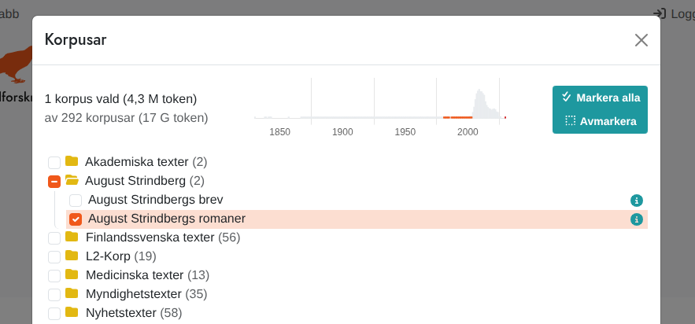
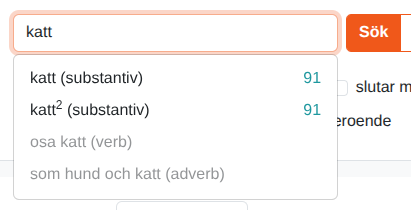
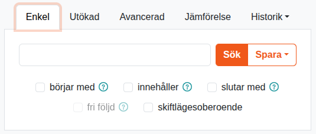
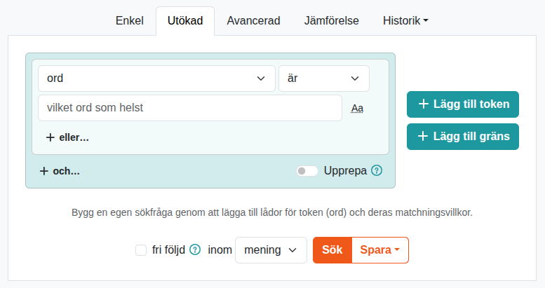
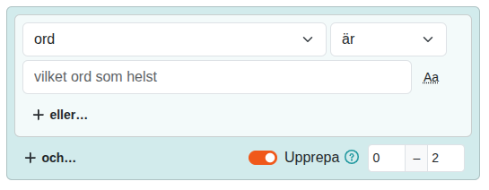
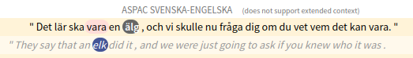
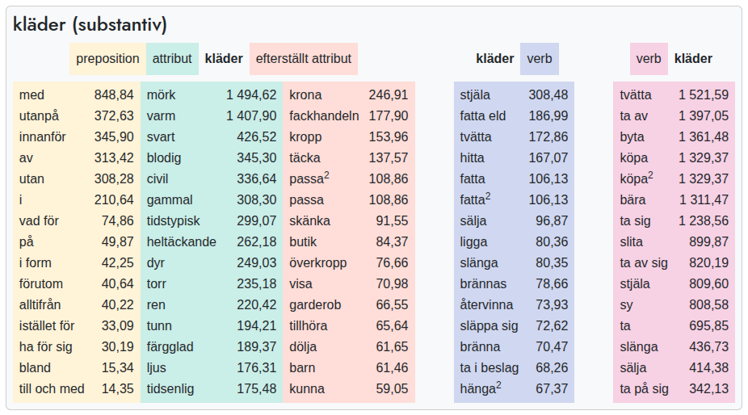
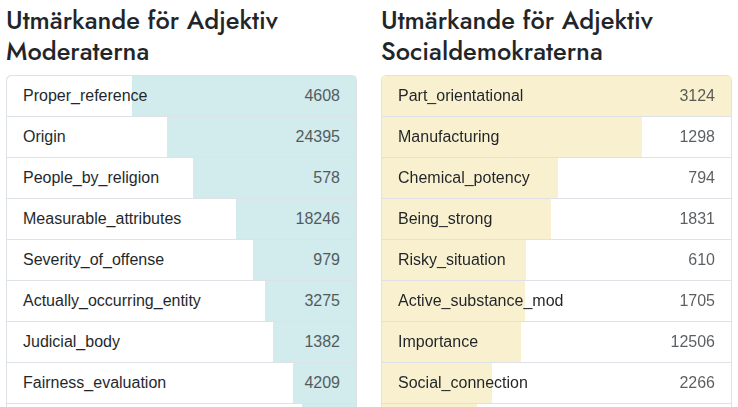

## Introduction

This is a user manual for the word research platform [Korp](http://spraakbanken.gu.se/korp/). Before you continue reading
we recommend that you visit the Korp page and do some test searches in order to get a rough picture of how the interface
works.

Korp lets you search large sets of text material from various sources,
such as fiction, news, social media and govermental publications.
The texts are enriched with extra information, known as annotations.
Most of the enrichment is the result of automatic processing,
which may contain errors.

## Different Korps

The material in Korp is divided into different modes. The default mode holds material written in contemporary Swedish
(from the 1900's and newer). On the very top of the page, above the Korp logo, you can find links to the other modes, including older Swedish texts, material in different languages and parallel corpora. The functionality can vary between the different modes and this manual is focused on Korp's default mode.

## The corpus selector

To the right of the Korp logo you can find the _corpus selector_ which is used to choose the corpus or corpora you would
like to search in. Some corpora are sorted into different categories. You can select a corpus or a category by ticking
the check box in front of its name.

To get more information about a corpus, click the blue info icon to the right. The information contains size in number
of tokens and sentences, and sometimes also other description.

Above the list of corpora there is a time line with bars that will give you an idea on the distribution of the material
over time. The selected corpora are shown as blue bars and the remaining material is shown in gray. Material that does not contain any time information is shown in red to the right of the time line.

## Searching in Korp

The Korp interface is divided into two main sections: the upper section where the search parameters are defined and the
lower section where the search result is shown. The search section has three different versions: _Simple_, _Extended_ and
_Advanced_, each of which allows for searches with different degrees of complexity.
The _Simple_ tab only allows for searches for words or phrases while _Extended_ offers tools for building more complex
queries. Usage of the _Advanced_ tab requires some knowledge about the query language used within Korp (CQP).

### Simple search

In a simple search one can choose to search for one or more words, or a _lemgram_. The latter includes all inflected
forms of a word or a multi word expression and thus makes it possible to search for e.g. "katt", "katter" och "katterna"
(different inflections of the Swedish word "cat") in a single query.

In order to perform an ordinary word search you need to enter the word(s) in the search field and hit the search button
(or press Enter on your keyboard). If you wait a little while before hitting the search button, a list with suggested
lemgrams matching the entered word will appear. A lemgram search is performed by selecting one of the suggested lemgrams
(by either clicking on it or using the arrow keys and then pressing Enter) and then sending the search query by clicking
the search button or hitting Enter.

Below the search field are a selection of check boxes, giving you a few options for your search.

**Free order**

When searching for more than one word, the default search requires all words to occur in exactly the given order next to each
other. By checking the _free order_ box, the search will instead find all sentences containing the search words, but the
order does not matter, and they do not need to occur in sequence.

**Part of a word**

The checkboxes _starts with_ and _ends with_ extend the search to words that include the given word at
the corresponding location.

In the case of a lemgram search, a compound analysis is used to determine matches.

**Case-insensitive search**

There is also a check box for _case-insensitive_ search. If it is ticked the result will include both upper-cased and
lower-cased words (i.e. searching for "katt" will also yield hits for "KATT" and "Katt"). This has however no effect on
a lemgram search since lemgram searches are always case-insensitive.

### Extended search

The Extended tag allows you to build more complex queries. Each blue box represents one _token_ (which usually is a word
or punctuation) and different criteria can be specified for each token.

You can add more tokens, and for each token add or remove _conditions_.
If you remove all conditions from a token, the token is removed.
When there is only one token with one condition – as in the initial state –
nothing can be removed.

You can drag-and-drop a token box to change the position in the sequence.

For each condition, choose an attribute, an operator and a value.
The operator list and the value widget can vary depending on the selected attribute.
The list of available attribute, in turn, depends on the currently selected corpora.

For some attributes, the value widget takes the form of a dropdown or an autocomplete.

Sometimes, there is a button labeled "Aa" next to the text input.
The button toggles case-insensitivity for that specific input.
By default, searching is case-sensitive,
meaning upper-case letters are considered different than lower-case.
Note that case-insensitive search is considerably slower.

Choose the _word_ attribute and leave the value input empty
to create a condition that matches any token.
The input placeholder says "any word" to signify this.

Each token may have one or more conditions.
They are combined in an outer _and_ level and a lower _or_ level.
(This structure is known as _conjunctive normal form, CNF_.)
Use the buttons _or..._ and _and..._ to add conditions on the respective level.

**Repetition, sentence start and sentence end**

In the bottom of each token box is the _Repeat_ option.
If you activate it, you can choose a lower and upper allowed value of the number of repetitions of the given token conditions.
This doesn't necessarily mean that the same matched token is repeated,
but it can be several different tokens, all matching the same set of conditions.
One useful application of this is to enter _word + is + (any word)_
and a repetition range of _0–3_ or similar.
This allows a gap between a previous and a following token.

**Start and end of a sentence**

Using the _Add boundary_ button, you can require a token to be next to the boundary a text unit.
After clicking the button, choose _start_ or _end_.
A _boundary token_ is created, where you can sometimes also choose a text unit type.
You can usually choose _sentence_, but sometimes also _paragraph_;
this depends on the corpora you have chosen.

Note that punctuation also counts as a token which means that the last token in a sentence most often is a full stop, not a word.

**Search across sentence boundaries**

By default, all searches are performed _within_ sentence boundaries, meaning you'll never get a
hit that extends beyond a sentence. For some corpora, however, it is possible to allow hits
that span a larger amount of text, such as a paragraph, making it possible to search across sentence boundaries.

The option to activate this can be found next to the _Search_ button under Extended search.
If the corpora you have chosen do not support extended context, only "sentence" can be chosen here.
However, if at least one corpus that allows extended context is selected,
you will be able to select an extended context in the list.

**Parallel Search**

Some of the corpora in Korp are so-called parallel corpora, which consist of two versions of the same text that are linked
at the sentence level.
Most often, these are texts in two different languages. The search result from such a corpus
consists of _pairs_ of sentences, one for each version of the text.
To be able to perform parallel searches, you must first
switch to the parallel mode in Korp, via the "Parallel" link at the top of the page.
Parallel search can only be performed with Extended search. This works mostly like a regular search,
with the difference that you now have the option to choose which of the language versions you want to search in.
This is done in a language menu above
the first token box. It is also possible to search in parallel in both languages by pressing the "More languages" button below the search button.
This
adds an extra row of tokens, in which one can specify search criteria for the second language.
Searching like this
means that your search criteria must be met by both languages in each sentence pair for a match to be found.
For example,
with a Swedish-English translation corpus, you can search for linked pairs where the Swedish part must contain the word "älg", while the English part
must contain "elk".
You can also tick the "Does not contain" box to specify that you only want hits where
the word "elk" \*does not\*\* appear in the English part.

For some corpora, in addition to sentence linking, there is also _word linking_. By marking a word in one language, you can then see which word or words in the other language this word corresponds to. Please note that word linking is usually done automatically and is therefore not completely
reliable.

### Advanced search

Regardless of whether you use Simple or Extended search, your query is converted into an expression in the CQP query language. Under the tab
_Advanced_, you can see the expressions for Simple and Extended search, as well as construct your own search query if you want to
do something more advanced than what is currently possible in an Extended Search.

To read more about the query language, see:

- [Att söka i Korp med CQP och Regexp – en introduktion (PDF)](https://www.gu.se/sites/default/files/2021-03/Att%20so%CC%88ka%20i%20Korp%20med%20CQP%20och%20Regexp.pdf) (Klas Hjortstam, 2018)
- [CQP Interface and Query Language Manual (PDF)](https://cwb.sourceforge.io/files/CQP_Manual.pdf) (Stephanie Evert & The CWB Development Team, 2022)

## Search results

The results view, which appears only after a search has been performed, is divided into three different sections: _KWIC_, _Statistics_, and _Word picture_.

### KWIC

KWIC, which stands for "keyword in context", displays the searched word or words in their context, usually a sentence.

If there are many search results, they are divided into a number of pages.
You can choose the number of hits per page, as well as sorting order.
Sorting can be done either by right or left context, on the hit itself, or randomly.
The sorting takes place only within each corpus.
With the default choice "not sorted", the hits will be displayed in the order they appear in the corpus (which may be a partially random order for copyright reasons).

Provided you have searched in more than one corpus, and the result spans multiple pages,
there will be a _distribution bar_ to the right of the number of hits the search yielded.
It contains buttons sized according to the number of results in each corpus.
Use the buttons to quickly find the page with the first hits from a given corpus.

The search hits are grouped by corpus, and the corpus which the subsequent hits come from is written in a heading above.

In the top right of the KWIC tab you can download the current hit page in various formats.
If you need all hits, you may want to increase the _Hits per page_ value and then download the hits of each page.

**Larger Context**

In some corpora it is possible to see a larger context than just a sentence, usually whole paragraphs.
Check the _Show context_ option to switch to an alternative hit page,
with more context where possible, and with each hit line wrapped for easier reading.
Otherwise, the context mode works just like the regular KWIC mode.

**Sidebar**

You can select a token in the KWIC by clicking it.
You can also navigate to an adjacent token with the arrow keys.
The selected token is highlighted in green.

With a token selected, a sidebar appears to the right.
This contains information about the selected token (under _Positional attributes_) as well as the sentence or larger text unit that the token is part of (under _Structural attributes_).
Positional attributes include things like part of speech, base form (lemma), compound analysis, etc.
Structural attributes may include author, year, etc.

Some attributes have a _details menu_ indicated by a dotted vertical line.
It may contain additional things like a confidence score, internal search and external search.
A _confidence score_ accompanies a value predicted from a model, and indicates how probable the prediction is.
_Internal search_ is a link you can click to create a new Korp search for the given value.
_External search_ is a link to information about the value in another platform.

When a token is selected, its _syntactical head_ in the sentence is also highlighted, in blue.

### Statistics

The Statistics tab shows a table where each column corresponds to a corpus, and the rows are made up of the different words or annotations matched by the search. By default,
the statistics are grouped by word forms, and a simple
search for only one word form will therefore only yield one row, while a search for a lemgram yields one row per word form that occurs in the material.
You can choose to group the statistics by attributes other than word form, for example part of speech or some text attribute.
For some attributes, you can select whether the grouping will be case-sensitive or not.

By clicking on the search hit text in a result row in the table, a new KWIC tab opens with the sentences that formed the basis of that particular row.

The table's cells show the number of occurrences in each corpus.
By enabling the _Show relative frequencies_ option, you can replace absolute frequencies with relative,
meaning the number of hits per million tokens.
Relative frequencies are more suitable for comparison between corpora.
By clicking on the column headings, you can sort the table in ascending or descending order according to the selected column.

If multiple corpora are chosen, there is also a column with pie chart icons.
Click the icon to open a graph of the distribution of hits between the corpora.
It shows both absolute and relative frequencies.

In the top right of the Statistics tab you can download the table data.

**Trend Diagram**

If any of the corpora searched contain time information, it is possible to produce a trend diagram. The trend diagram is based on rows in the statistics table,
and shows their relative frequency over time. The relative frequency is calculated as the number of hits per million tokens for each specific unit of time.

To get to the trend diagram, first select one or more rows from the statistics table using the checkboxes on the left
(or leave the default selection of the totals row),
and then click the _Trend graph_ button.
A new tab will then open and load the trend diagram.
The horizontal axis of the diagram shows time, while the vertical axis shows relative frequency.
Each line in the diagram corresponds to a selected row in the statistics table, and in the legend on the right, you can toggle the rows you want to show. By
clicking on a point on a line, a new tab opens with all hits for that particular point in time.

Below the trend diagram there is a miniature version of the chart with handles that can be used to zoom in and pan around the large chart. The resolution of the trend chart's time axis
is determined by the size of the time span displayed, and by zooming in it is possible to display time information down to the level of seconds, provided the selected material supports it.

Choosing _View Bar_ or _Table_ to change the line graph to a bar chart or a table.
In the top right of the tab you can download the table data.

**Map**

Frequency statistics can also be shown as sized markers on a map.
Like the trend graph, it is based on rows from the Statistics table.
Select one or more table rows using the checkboxes in the leftmost column,
and click the _Map_ button.

In the menu that appears, you choose which attribute you want to base the map on. For some corpora it is only possible
to base the map on co-occurrence with place names at the sentence or paragraph level, i.e. it looks for place names in the context of the given hit. But for other corpora there is also location information in the metadata, e.g. of a blogger's
hometown, and then the map can be based on that information instead.

With the _Relative_ option enabled, the marker of each location is sized in relation to
how often that location is represented in general within the selected material.
This may more clearly indicate what locations are especially associated with the search query.

After clicking the _Open map_ button, a new map tab will open.
Hovering a marker will produce a box to the right, containing hit frequencies for that location.
Clicking the marker makes the location box remain visible even if you away from the marker.
You can then click a hit value in the box to open a KWIC tab with all the hits for that location.

Enable the _Cluster markers_ option to make groups of nearby markers merge to one.
This also changes the marker shape, from circles to bars.
Hovering or clicking a clustered marker will display one box for each location included.

### Word picture

To generate a word picture, the search query must contain a single word or lemgram. In extended and advanced search, that means a single token with a single condition on the _word_ or _lemgram_ attribute.

Here, the searched word is displayed together with words that it has
syntactic relations to in the material, grouped by relation. For a verb, for example, the subjects and objects that are particularly characteristic of that particular verb are displayed, and for a noun, characteristic modifiers are shown, as well as verbs of which the noun is subject and object.

Next to each related word is a measure of its association to the search word within the selected material.
You can choose to measure and sort by absolute frequency (count) or Lexicographer's Mutual Information (LMI).
The LMI measures the frequency of a certain word pair in relation to the frequencies of each single word.
Thus it disfavors words that have a high co-occurrence merely by being common in general, such as "be" and "have".

Clicking a word in the table brings up a new drilldown KWIC tab with the selected word pair and relation.

## Comparisons

The Comparison feature visualises what values are strongly associated with one subset of the corpus material as compared to another.

First, you need to create and save two search queries.
Choose corpora and phrase a search query as usual.
Click the _Save_ button next to the _Search_ button and choose a suitable name.
(You don't have to perform the search, but it can be useful for checking that it matches your intentions.)
Then do the same for another query.

Open the _Comparison_ tab, located after the three search tabs.
Choose the two searches and what attribute to compare by.

The resulting view presents a column for each search, containing values of the selected attribute.
Next to each value is the number of hits.
More importantly, the _log-likelihood (loglike)_ is also calculated.
This tells you how closely associated the value is to one search as compared to the other.
The loglike value determines the width of the coloured bar in the background, as well as the ordering in each column:
values most closely associated to the first search are in the top of the left-hand column,
and those most closely associated to the second are in the top of the right-hand one.

Click a row to open a KWIC tab with all the hits included in it.

